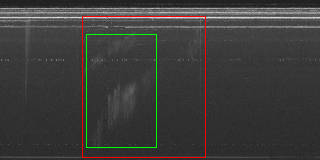
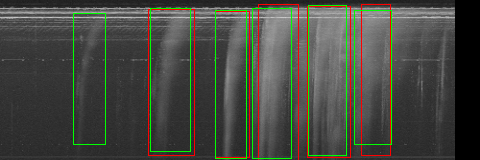
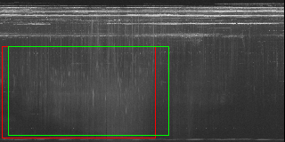

# Solar Radio Bursts Detection with CNN detector

Solar burst (Type II, III, IV events) detection on time-frequency images captured from Nançay Decametric Array 

## Folder content

### data

Download data here from : https://realtime.obs-nancay.fr/dam/data_dam_affiche/data_dam_affiche.php and put it in subfolders with name formatted like this YYYYMM

### data_proc

This folder contains the scripts to run to preprocess the data. 
* For training the CNN model, launch generate_tfrecord.py. This will split the dataset into a train and a test set and record in separate files the periods selected.
* For training SVM model, launch generate_perturbations.py. You can optionally set the path of the two files created during tf record generation to create a dataset based on the same train/test distribution.

### eval

This folder contains the evaluation scripts. 

### object-detection

This folder contains the scripts for training the CNN models on GCloud.  Change in this script the path to Tensorflow object-detection library.

### examples of detection

groundtruth is in green, detection in red

#### type II

#### type III

#### type IV

